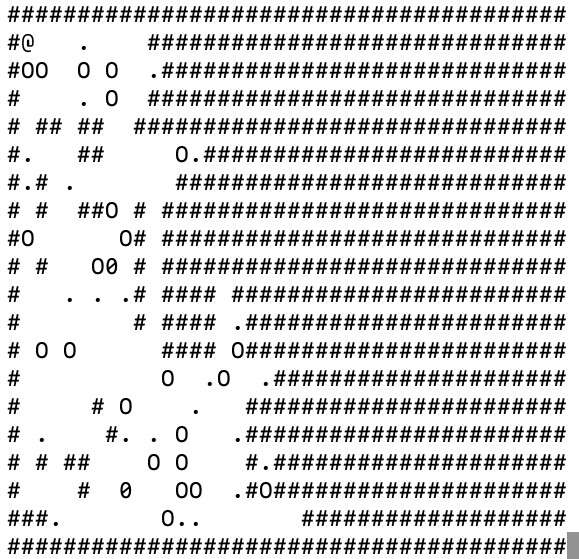

# soKBan (1 kilobyte Sokoban remake)


### Overview
soKBan is a simple puzzle game which fits in one kilobyte (1024 bytes) of C source code.
It is a remake of the original [Sokoban](https://en.wikipedia.org/wiki/Sokoban) game 

### Compile
soKBan should compile an any Unix based system (tested an MacOS)

It requires [ncurses](https://www.gnu.org/software/ncurses/ncurses.html) and a c compiler ([gcc](https://gcc.gnu.org/) recomended) to build, so make sure you have both
```
$ git clone https://github.com/dragonsploder/soKBan.git
$ cd soKBan
$ gcc -osokoban -lncurses Sokoban.c
$ ./sokoban
```

### Play
The goal of soKBan is to move every boulder to the correct place. You control the at sign (@) with the wasd keys. By moving onto a tile with a boulder, you will push the boulder onto the next tile.
```
|@O |> - d - >| @O|
```
You can only move one boulder at a time.
```
|@OO |> - d - >|@OO |
```
The correct place for a boulder is marked by a '.'. When you place a boulder in the correct spot, it will turn into a zero
```
|@O.|> - d - >| @0|
```
* You can also move boulders out of the correct spot spot
```
| 0@|> - a - >|O@ |
```

At anytime you can reset the level by pressing r

### Notes
* If you are playing somewhere where capital o (O) and zero (0) look very similar, you can replace every instance of 48 (decimal equivalent of zero in ascii) in Sokoban.c with a different number (like 42)
* This can be smaller, and may change in the future with different versions